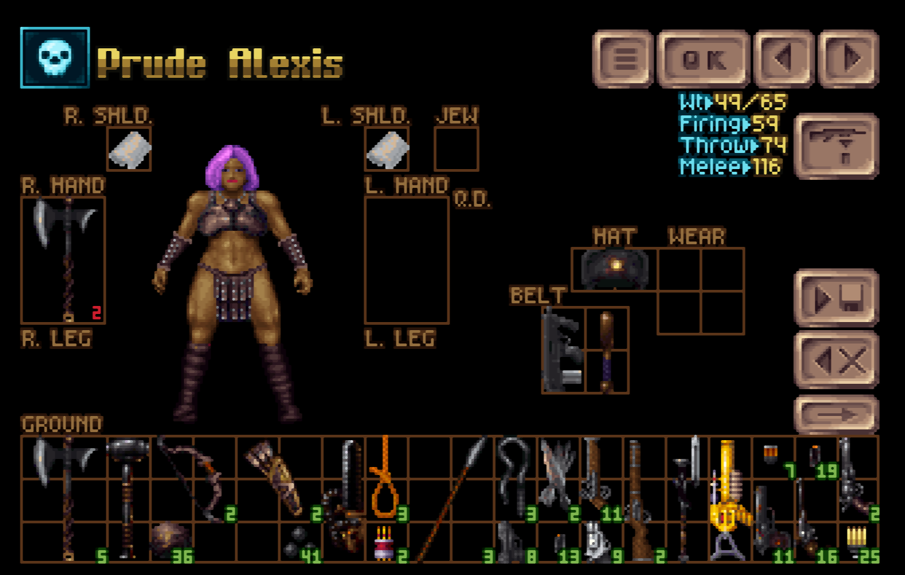
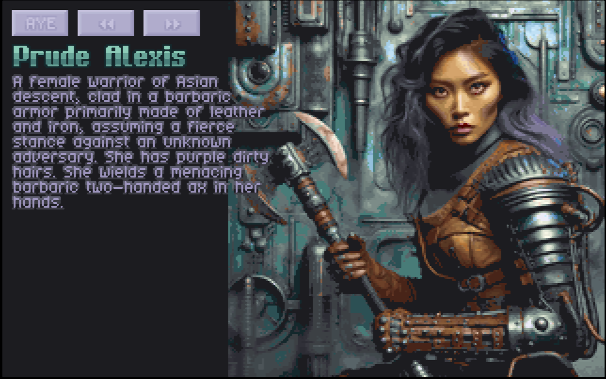
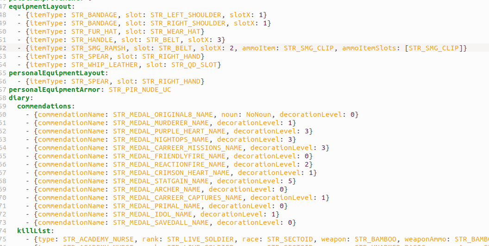
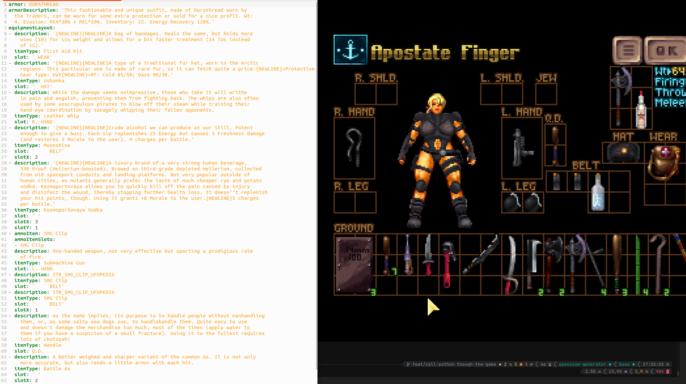
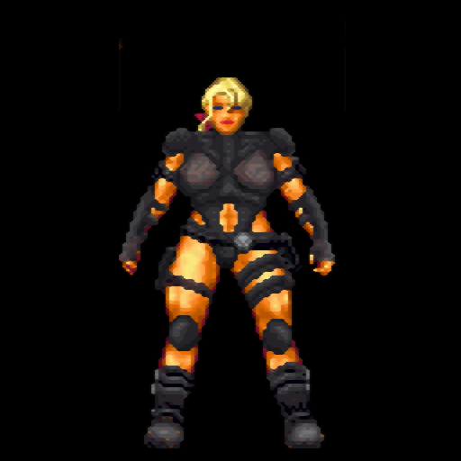
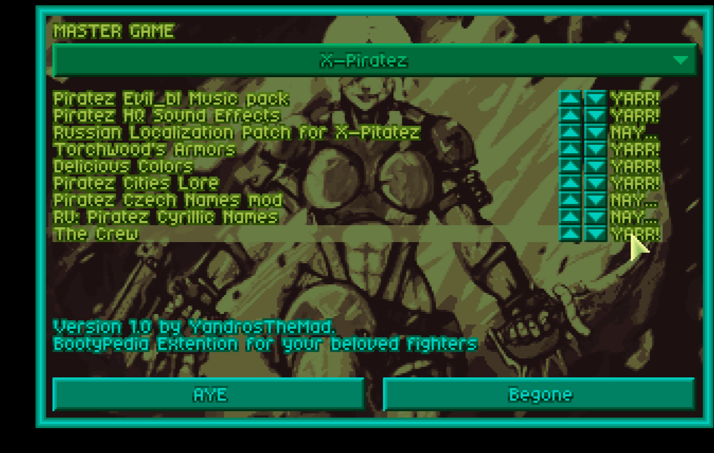

# OpenXcom AI Generator

## Abstract

The project roughly aims to create player customized content thanks to AI.
The objective is to provide better player implication by creating more emotional attachment.

Current state overview:
- working semi-manual process to create Ufopedia articles for your soldiers character.

Example result
- Start:
  

- Generated from dalle-3:
 


- After converting to game resource:
  


## Pipeline

The pipeline is roughly
- gather information / image
    - manual - take a screenshot of the inventory screen (must be 'screen000.png' in the user folder location)
    - on click in the inventory screen, signal the python pipeline to start and serialize the soldier definition for additional data to help generation
    
    - convert the yaml extract to yaml payload with translations
      
    - this yaml equipment_description (1)
- describe image (GPT-4 Vision)
  - rework screenshot into a valid 512x512 GPT-4 Vision input
   
  - ask GPT-4 Vision to describe the image
  - this json is the appearance_description (2)
- ask GPT-4 Completion to generate an origin story including the information extracted with (1) and (2)
  - this text is the character_story (3)
- ask GPT-4 Completion to generate a dalle-3 prompt with (1), (2) and (3)
  - IN PROGRESS
- execute prompt and get image
- convert image to 8-bit indexed with the correct color palette 320x200 png
- add the necessary yaml to the mod to create the corresponding UFOPedia entry~~~~
- update the mod files
- reload the mod in-game (toggle the mod in Mods)
    


Each core module can be used as a standalone script.

### Modules overview

#### Dalle
  responsible to imagine images through the Dalle-3 api
#### Chat
  responsible to generate data from resources for other services
#### Image
  responsible to transform images to valid payloads for services
#### Conversion
  responsible to convert from an api response to a game ready image file
#### Modding
  responsible to generate the associated game file for the resources
#### Openxcomgenerator
  responsible for orchestration of the pipeline by calling the other modules


## Installation for development
Be sure to execute this from a non-venv shell

```shell
virtualenv venv
source .venv/bin/activate
pip install poetry
poetry install
pre-commit install
pre-commit install --hook-type commit-msg
```

## Commands / Scripts

### Local mod release for development
Update the paths first to match your env
```shell
./scripts/local-mod-release.sh
```

### Generate release executable with dependencies
The executable is produced in /dist and needs to be allowed to execute with 'chmod +x /dist/main' 
```shell
poetry run pyinstaller --onefile src/openxcomgenerator/main.py
```

### Tools
- Check lint

```shell
poetry run ruff src 
```

- Fix code formatting
```shell
poetry run black src 
```

- Run tests
```shell
poetry run pytest 
```

- Static typing
```shell
poetry run mypy src 
```

### Build

## Package management
Poetry: https://python-poetry.org/

## Quality

### Tools
#### Linter
Ruff: https://docs.astral.sh/ruff/

#### Prettier
Black: https://black.readthedocs.io/en/stable/

#### Tests
PyTest: https://docs.pytest.org/en/7.4.x/

#### Conventional Pre-Commits
Using the [conventional commits standard](https://www.conventionalcommits.org/en/v1.0.0/#summary) through the [conventional-pre-commit package](https://github.com/compilerla/conventional-pre-commit)

#### Hooks
PreCommit: https://pre-commit.com/

#### Static typing
Using mypy


### CI
[Github Actions](https://docs.github.com/en/actions) is the integrated Continuous Integration and Deployment tool in GitHub

The deployment history is available [under the Actions tab](https://github.com/bluemapping/compute/actions/)

Notable workflows use cases are:
- `validate` on push on an allowed branch.


## Recommended IDE PyCharm Configuration
### Plugins
Ruff: Settings > Plugins > Marketplace > "Ruff"

### Actions on save
Black: Settings > Tools > Black
- On Code Reformat
- On save
  both need to be checked.

### File nesting
Project tool window | '...' (vertical) | "File Nesting..."
Set (click on the '+' sign)
- 'Parent File Suffix': '.py'
- 'Child File Suffix': '_spec.py'

